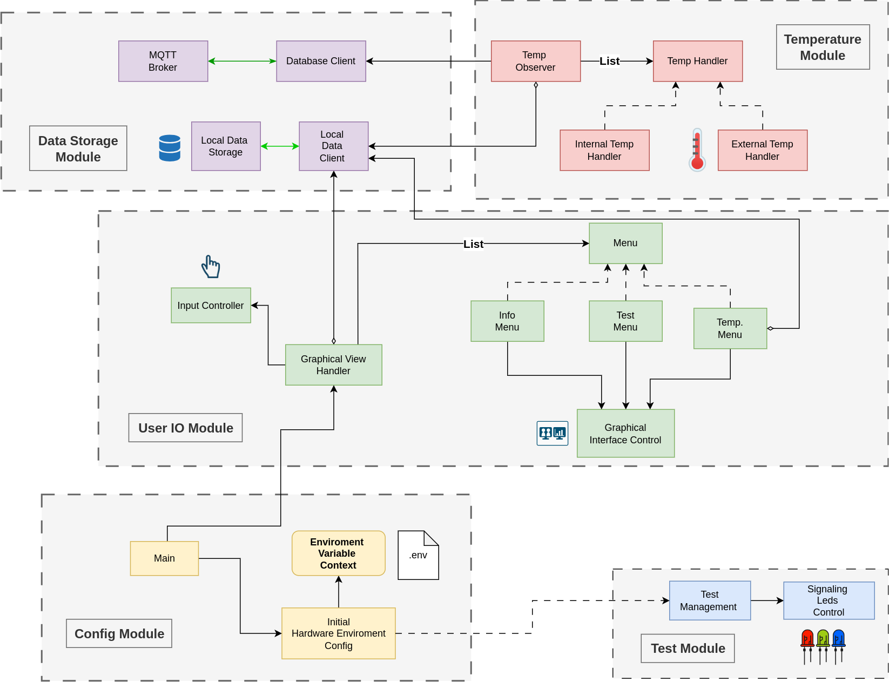
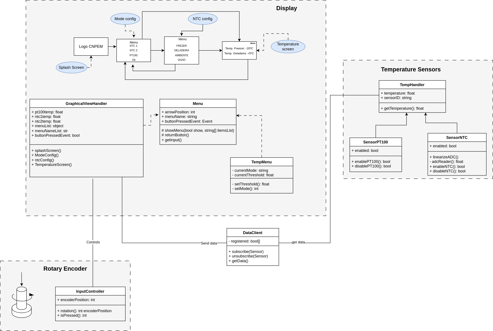

# BioTemp Temperature Measuring System Firmware

## Brief Description
Firmware source code for the control and operation of the BioTemp temperature measurement system. 
The hardware project files for the system can be found [here](https://github.com/cnpem-emi/biotemp-hw). 
The code was developed using the PlatformIO environment for VSCode. For more information about the modules, check the notebooks folder.

## Functional Diagram
The biotemp system is composed of different modules that serve the separation of concerns between the different featured functionalities.

## Class Diagram
The source code can be described by the following class diagram.
